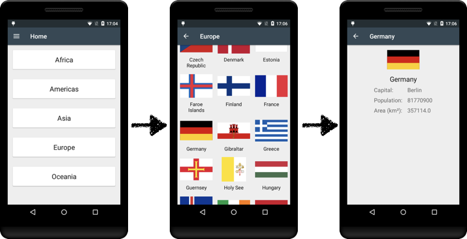

# FLAGORAMA

## Description

Display the flags of the different countries of the world. Along with some information about the
countries.

## Purpose

This is intended as a playground to experiment with the Jetpack libraries & other Android 
technologies.

Technology stack:

- [x] Kotlin (of course)
- [x] Coroutines for background processing
- [x] Jetpack Navigation for navigation between screens
- [x] Jetpack ViewModel and LifeCycle for the architecture
- [x] LiveData and Data Binding for the communication between components
- [x] Room database for local storage
- [x] Retrofit for network access
- [x] Coil for download of images
- [x] Timber for logging
- [ ] Hilt for dependency injection

This is still a work in progress.

## Technical documentation

* [Architecture](./doc/architecture.md)

## Copyrights and licenses

The source code is copyrighted by Tony Guyot (verdaroboto@gmail.com) and is released under the 
Apache 2.0 license.

The data for the countries and flags is provided by <<https://restcountries.eu>>. They are using the
Mozilla Public License MPL 2.0. The source code is available on GitHub: 
<<https://github.com/apilayer/restcountries>>.

 
