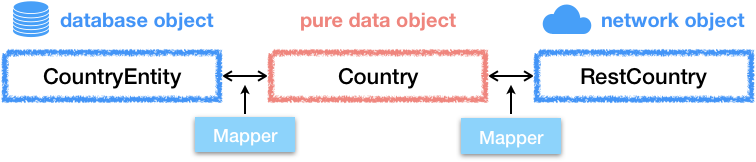
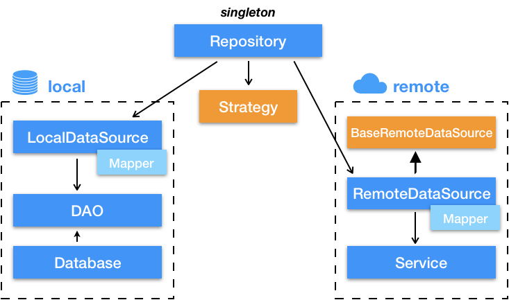
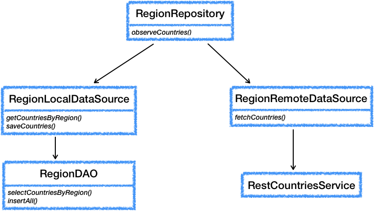
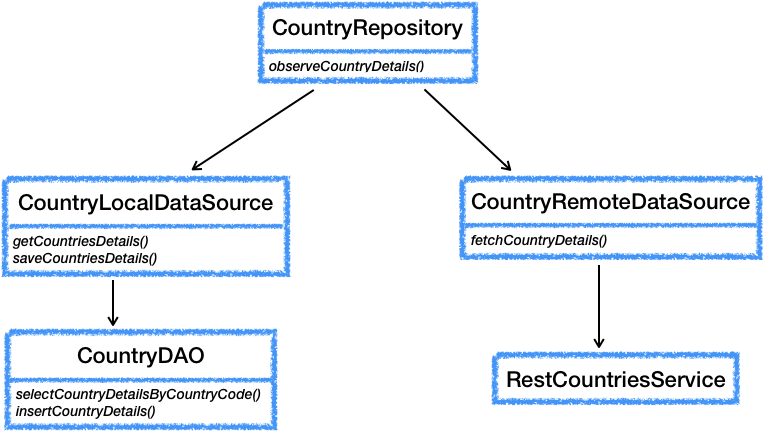

# Architecture

## 1. References

This app uses the MVVM architecture with the repository pattern. It is an extended work from the
architecture described in [Guide to app architecture](https://developer.android.com/jetpack/guide).
It uses also some ideas from [Eli-Fox, LEGO-Catalog](https://github.com/Eli-Fox/LEGO-Catalog).

## 2. General overview

### 2.1 About model entities

Usually examples of Android app architectures are mixing everything in the model entities. This is a
bad practice: database or JSON specific annotations are then carried in the whole application.
Worse some fields exist only because they have some implementation purpose for the database for
example. Those fields shouldn't be seen by the UI.

In Flagorama, the model entities are pure business objects: they do not carry any implementation or
storage/access information. Both the database and the network access have their own entities with
all the required annotations and sometimes specific fields. Mapper classes provide the necessary
conversions between the different types of entities.



The pure data class is a Kotlin data class and contains only type declaration that are useful in
the business logic of the application:

```kotlin
data class Country(val code: Alpha3Code, val name: String, val flagUrl: String)
```

The corresponding network access data class contains information that is relevant only to the JSON
parser:

```kotlin
data class RestCountry(
    @field:SerializedName("alpha3Code") val code: Alpha3Code,
    @field:SerializedName("name") val name: String,
    @field:SerializedName("flag") val flagUrl: String
)
```

The corresponding database data class contains information that is relevant only to the database
parser:

```kotlin
@Entity
data class CountryEntity(
    @PrimaryKey val code: Alpha3Code,
    @ColumnInfo(name = "region_code") val regionCode: String,
    @ColumnInfo(name = "name") val name: String,
    @ColumnInfo(name = "flag_url") val flagUrl: String
)
```

### 2.2 MVVM architecture


**Fragment**:

* *View* part of the MVVM architecture
* is an instance of `androidx.fragment.app.Fragment`
* handles only the UI
* has no logic

**ViewModel**:

* *ViewModel* part of the MVVM architecture
* is an instance of `androidx.lifecycle.ViewModel.ViewModel`
* performs the binding between the UI and the source of data
* transforms raw data to make it suitable for display, if necessary
   
**Repository**:

* *Model* part of the MVVM architecture
* is a singleton
* provides a unique entry point to all data access
* abstracts several possible sources of data
* defines a data workflow

### 2.3 Repository pattern



Classes in blue are always specific to the application. Classes in orange are utility classes that
are independent of the application.

**LocalDataSource**:  

* encapsulates the access to the database
* provides conversions between database entities and application data (with its `Mapper` 
      companion object)
* provides error management

**DAO** (Data Access Object):  

* is is an interface (Room generates automatically an implementation class)
* defines the queries and operations to be performed on the database
* returns only database entities

**Database**:  

* generates the implementation classes from the DAOs to enable access to the database

**RemoteDataSource**:  
    
* encapsulates the access to the network service
* provides conversions between communication entities and application data (with its `Mapper` 
      companion object)

**BaseRemoteDataSource**:

* is an abstract class
* base class of all RemoteDataSource classes
* provides generic HTTP response handling

**Service**:

* is an interface (Retrofit generates automatically an implementation class)
* defines the requests to be performed over the network
* returns only network entities

**Strategy**:  

* defines the type of workflow used by the repository
* orchestrate the different data sources
* handle the background processing (using coroutines)

### 2.4 Strategy

The strategy (corresponding to the `NetworkBoundResource` in the official Android developer
documentation) is very important since it enables to define a given strategy (for example: database
first) and then all repositories need only to pass the appropriate lambdas to the selected
strategy.

Here is the example of a Repository in Flagorama:

```kotlin
class RegionRepository(
    private val local: RegionLocalDataSource?,
    private val remote: RegionRemoteDataSource
) {
    fun observeCountries(region: String) = DatabaseFirstStrategy.getResultAsLiveData(
        databaseQuery = { local?.getCountriesByRegion(region) ?: emptyList() },
        shouldFetch = { it.isEmpty() },
        networkCall = { remote.fetchCountries(region) },
        saveCallResult = { local?.saveCountries(it, region) }
    )
}
```

The algorithm for the database strategy is the following:

    emit LOADING + no data
    retrieve data from database
    check if data is up-to-date
    if data is up-to-date:
        emit SUCCESS + data
    otherwise:
        emit LOADING + data from database (if any)
        fetch data from network
        if network call is successful:
            save data to database
            emit SUCCESS + data
        otherwise:
            emit ERROR + error code

## 3. Implementation in Flagorama

Flagorama has three screens using this architecture:


### 3.1 Home screen

The home screen provides a list of world regions (continents) to select from. This is the simplest 
screen: since the list is fixed, there is no data retrieval here and therefore no repository. A view
model is used nonetheless as it provides a simple example.


* The view model (HomeViewModel) exports the data (the list of regions) using **LiveData**.
* The UI (HomeFragment) observes this data and uses it to populate a list.

### 3.2 Region screen

The region screen displays the list of countries and their flags corresponding to the region
selected in the previous screen.




### 3.3 Country screen

The country screen displays details about the country selected in the previous screen.



